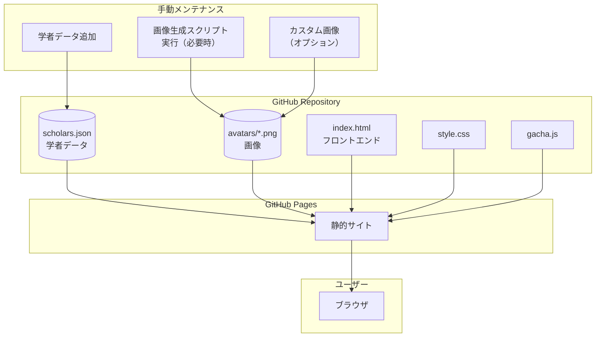
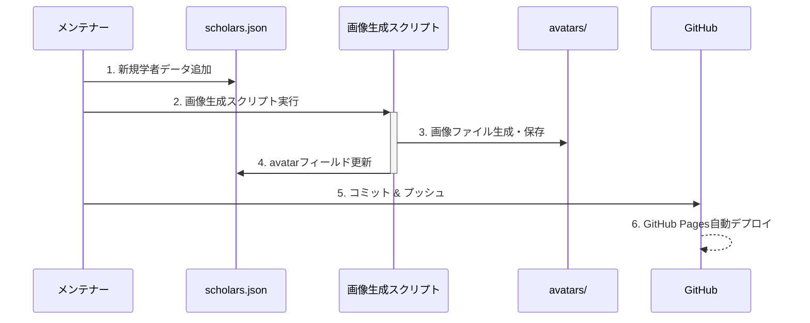

# Epi-Gacha プロジェクト開発計画と進捗状況

このドキュメントは、統計・公衆衛生学者ガチャプロジェクトの開発計画と進捗管理を行うためのものです。

## プロジェクト概要

「Epi-Gacha」は、統計学者・公衆衛生学者の情報をガチャ形式で提供するウェブアプリケーションです。ユーザーは「ガチャ」ボタンをクリックして、ランダムに選ばれた学者の情報カードを閲覧できます。シンプルなインターフェースと静的ファイル構成により、運用コストをほぼゼロに抑えています。

## システム構成

## 開発フェーズ

### フェーズ1：基本構造整備（完了）

- [x] GitHub リポジトリ作成
- [x] 基本ディレクトリ構造設定
- [x] scholars.json スキーマ設計と初期データ
- [x] README.md 作成

### フェーズ2：画像生成システム（完了）

- [x] OpenAI API利用の画像生成スクリプト作成
- [x] 手動実行用GitHub Actionsワークフロー設定
- [x] 画像保存・管理の仕組み実装

### フェーズ3：フロントエンド（完了）

- [x] HTML/CSS基本構造
- [x] シンプルなガチャ機能JavaScriptの実装（1連ガチャのみ）
- [x] カード表示コンポーネント（レスポンシブデザイン）
- [x] レアリティ表示（N, R, SR, SSR）とアニメーション効果
- [x] フィルター機能の実装（専門分野別）
- [x] SSR演出エフェクト
- [x] カード表示の強化（貢献・豆知識セクション分割）
- [x] レアリティ表示の強化（フレーム、エフェクト、華やかな演出）
- [x] SR用の専用エフェクト追加

### フェーズ4：コンテンツ拡充（進行中）

- [x] データ構造の拡張（貢献情報と出典の追加）
- [ ] 追加学者データの収集と登録
- [ ] タグ・カテゴリーの整備
- [ ] トリビア情報の充実
- [x] 参考文献・出典の拡充

### フェーズ5：機能拡張（計画中）

- [ ] フィルター機能の強化（複数条件の組み合わせなど）
- [ ] 「お気に入り」保存機能（localStorage活用）
- [ ] 履歴表示機能
- [ ] モバイルUIのさらなる最適化
- [ ] PWA対応（オフライン利用）

## データ拡張計画

目標学者数：
- 初期リリース：10〜20名
- 第2弾：50名
- 最終：100名以上

優先収集カテゴリ：
1. 統計学の基礎を築いた人物
2. 疫学の主要研究者
3. 現代の公衆衛生学に影響を与えた人物
4. 日本の著名な統計・疫学者

## メンテナンスワークフロー

代替フロー（手動画像追加）:
1. 学者データをscholars.jsonに追加
2. 画像を別途用意し、avatars/{id}.png として保存
3. scholars.jsonのavatarフィールドを手動更新
4. コミット & プッシュ

## コスト見積もり

| 項目 | 単価 | 想定回数 | 予算 |
|------|------|----------|------|
| 画像生成 API | $0.04/枚 | 初期:20枚 追加:10枚/月 | 初期:$0.8 月次:$0.4 |
| GitHub Pages | 無料 | - | $0 |
| ドメイン（オプション） | $10-15/年 | 年1回 | $10-15/年 |

## 担当者

- コンテンツ管理：
- 技術開発：
- デザイン：

## 実装済みの機能

- **ガチャ機能**: 「ガチャ」ボタンを押すとランダムに学者が1名表示される
- **カード表示**: 学者の情報（名前、所属、専門分野、貢献、豆知識など）をカード形式で表示
  - **貢献・豆知識の分離表示**: 名前の後に統計学や公衆衛生学への貢献と豆知識を2段構成で表示
  - **出典表示**: 各セクションに個別の出典リンクを表示
- **レアリティ表示**: N, R, SR, SSRの4段階のレアリティ表示とビジュアル効果
  - **カラーフレーム**: レア度に応じた色付きフレーム（SSRは金、SRは銀など）
  - **華やかな演出**: レア度に応じたエフェクト（SSRはキラキラパーティクル、「SSR GET!!」テキスト表示など）
  - **背景エフェクト**: 高レア度カードの背景効果
- **フィルター機能**: 専門分野でフィルタリングするオプション
- **アニメーション**: カードのスライドイン、SSR/SR時の特別エフェクト
- **レスポンシブデザイン**: モバイル端末を含む様々な画面サイズに対応

## 次のアクション項目

1. scholars.jsonへのデータ追加（サンプル以外の学者データを収集・追加）
2. 画像生成の手動テスト実行（OpenAI APIを使用）
3. GitHub Pagesでの公開設定
4. ユーザーフィードバック収集
5. 音声効果の検討（レア度に応じたサウンド効果）
6. データセットの拡充（より多くの学者情報の追加）
